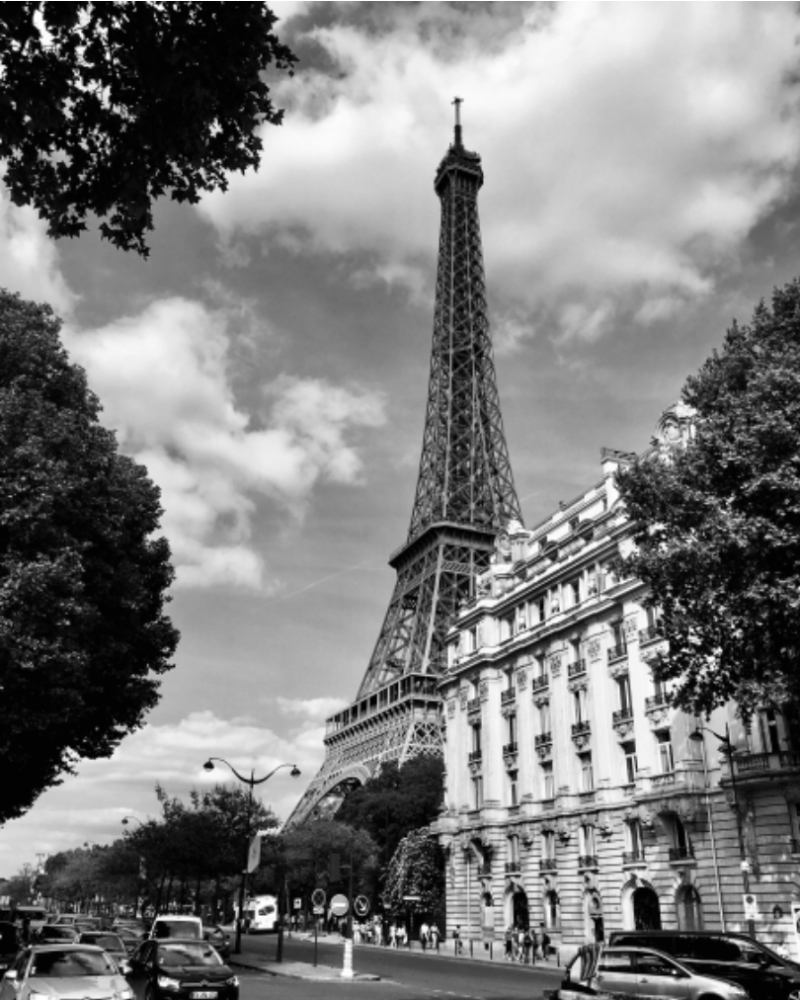
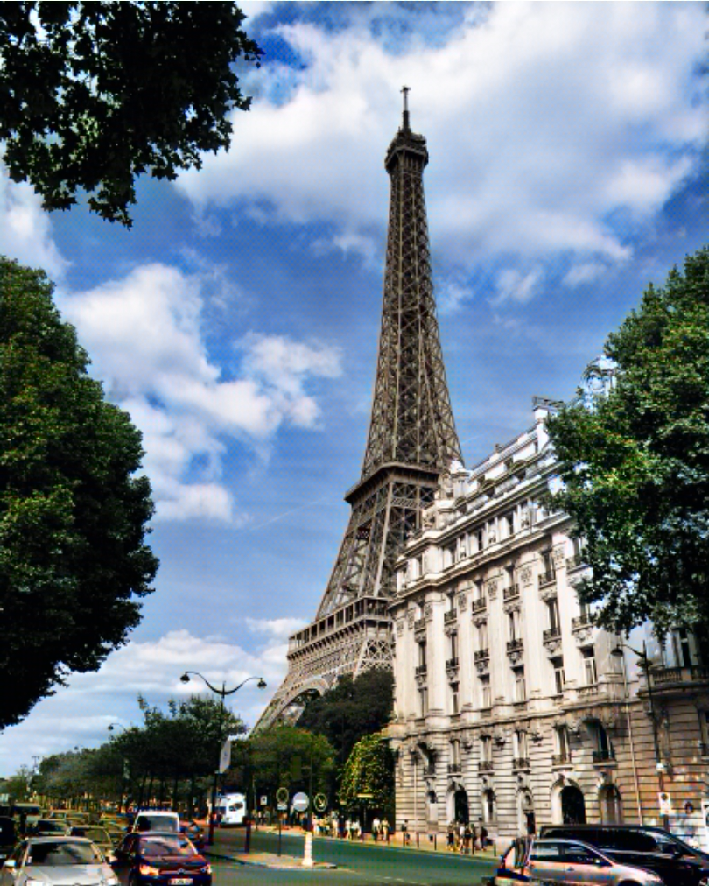

[](https://onnx.ai/)

# deoldify-onnx-web
old photo image colorize
[英文文档](./README.md)｜[中文文档](./README_CN.md)




# install
you can go release page and download the model, then put it into models folder

## onnx quantize export 
the original model i have download from deoldify onnx release page, then i convert from that.
you can see the model in models directory and see the demo in index.html

``` python
import onnx
from onnxruntime.quantization import quantize_dynamic, QuantType

model_fp32 = './deoldify.onnx'
model_quant = './deoldify.quant.onnx'
quantized_model = quantize_dynamic(model_fp32, model_quant, weight_type=QuantType.QUInt8)

```

## Credits
If you use any ideas from the papers or code in this repo, please consider citing the authors of [deoldify](https://github.com/jantic/DeOldify). Lastly, if the ONNX versions helped you in any way, please also consider starring this repository.


