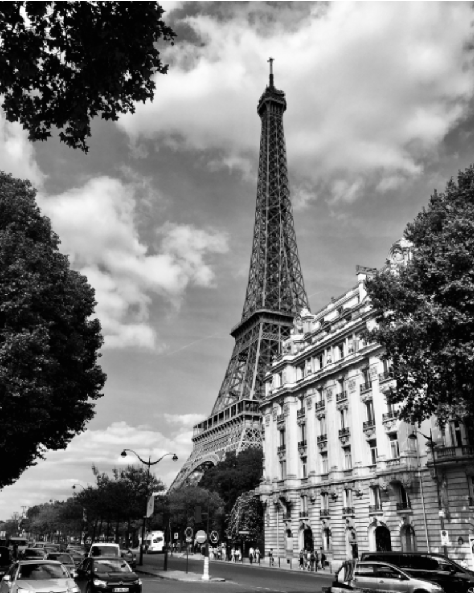
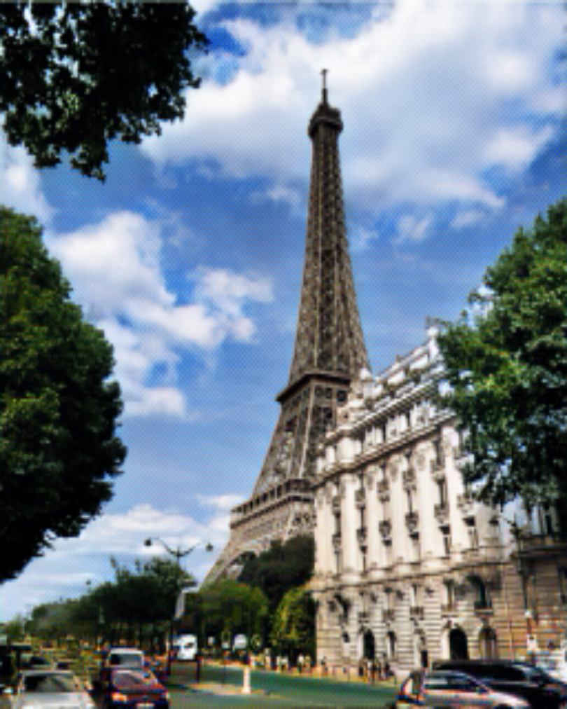

[](https://onnx.ai/)
# deoldify-onnx-web
老照片上色功能，纯web端实现
[英文文档](./README.md)｜[中文文档](./README_CN.md)





## onnx 量化导出
我将原有的deoldify模型下载下来并进行了量化导出

``` python
import onnx
from onnxruntime.quantization import quantize_dynamic, QuantType

model_fp32 = './deoldify.onnx'
model_quant = './deoldify.quant.onnx'
quantized_model = quantize_dynamic(model_fp32, model_quant, weight_type=QuantType.QUInt8)

```

## Credits
If you use any ideas from the papers or code in this repo, please consider citing the authors of [deoldify](https://github.com/jantic/DeOldify). Lastly, if the ONNX versions helped you in any way, please also consider starring this repository.
